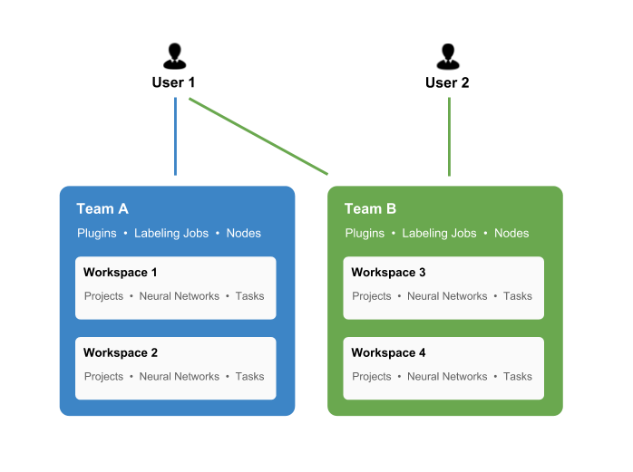
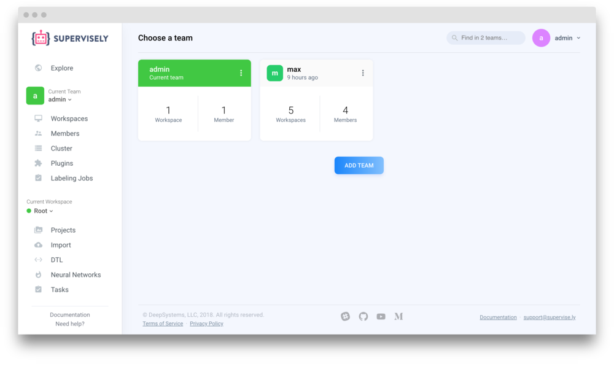
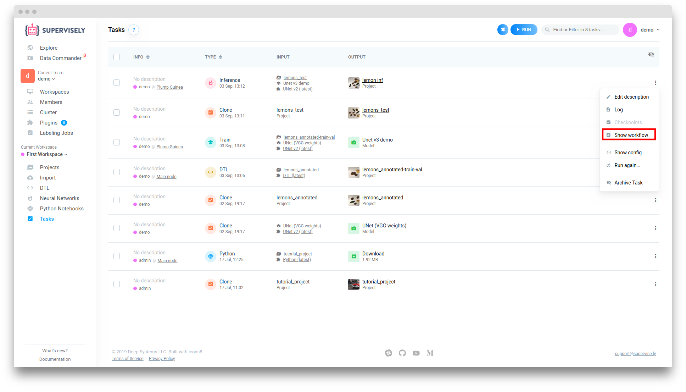
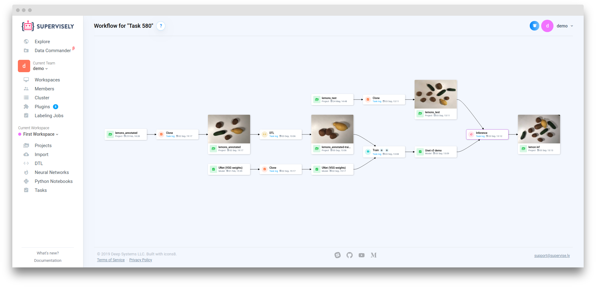
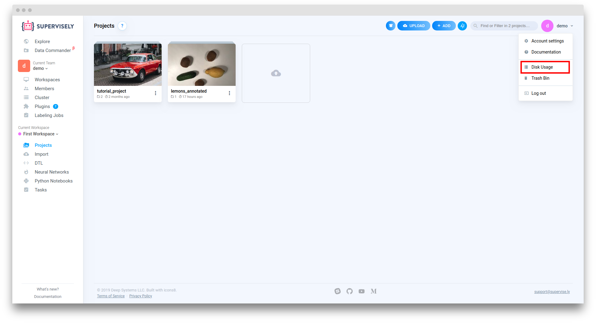
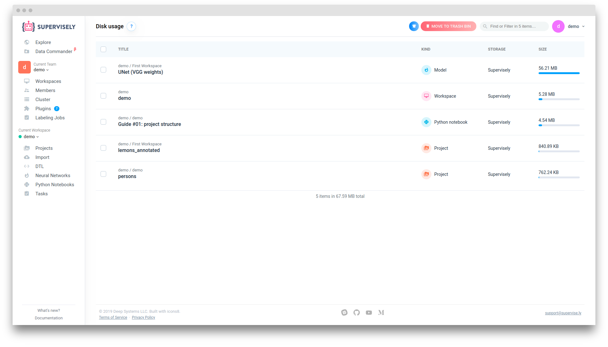
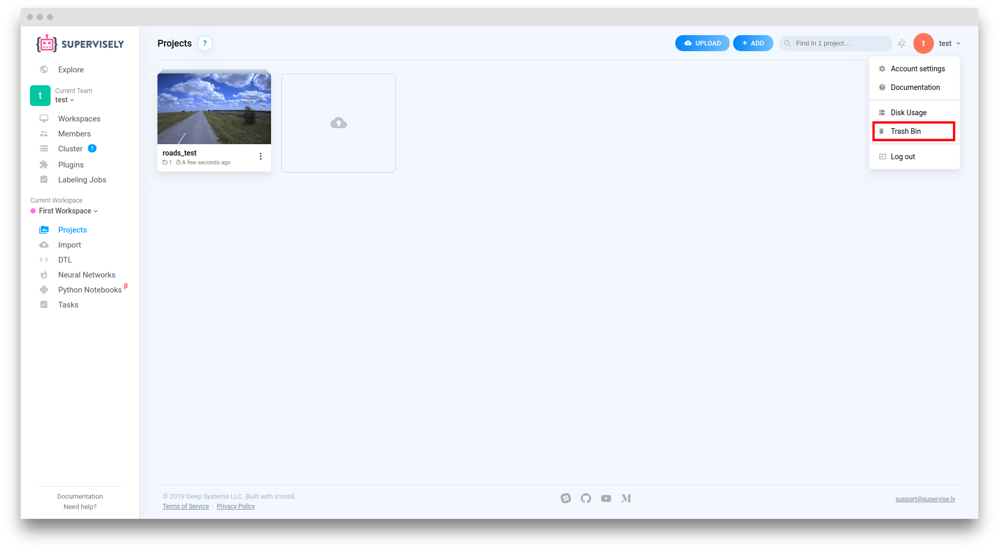
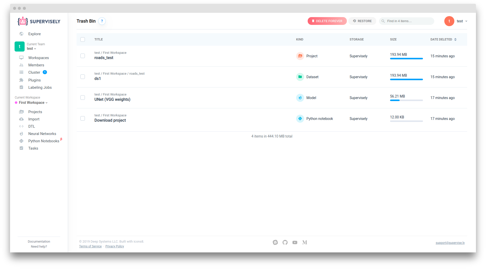
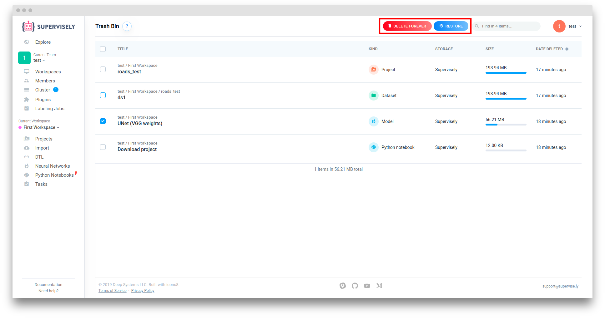

# Teams

Supervisely allows you to manage and develop datasets, models, custom extensions and many other entities.
It is important to understand how we organize users, resources and access permissions.

Team is a group of users and resources.

Users in the same team share the same resources, like projects and models.

When you login to Supervisely, your last team will be selected. At every moment you work in a particular team and all new items like projects you create will be created in that team. You cannot create entities like projects outside of a team or have the same project in multiple teams at once (you can share them with Explore, Clone and Links, read below). 

You can switch teams at any moment or create a new team in the left menu.

### Workflow

Sometimes it’s difficult to understand where a Project, Task or Model came from. To view the interaction sequence of an element, you can visit the "Workflow" page.

To do this, you need to open the item's context menu and select "Show workflow" menu item.

### Disk usage

To view disk usage in current team you can visit "Disk usage" page.

Here you can see Projects, Models and Python Notebooks from all Workspaces in current Team.

### Cleanup

When you remove Projects, Models and Python Notebooks they will be moved to Trash Bin.

All removed Projects, Models and Python Notebooks from current Team are located here. 

To delete or restore an item you need to select it by clicking the check mark next to it. Then click "Delete forever" or "Restore"

