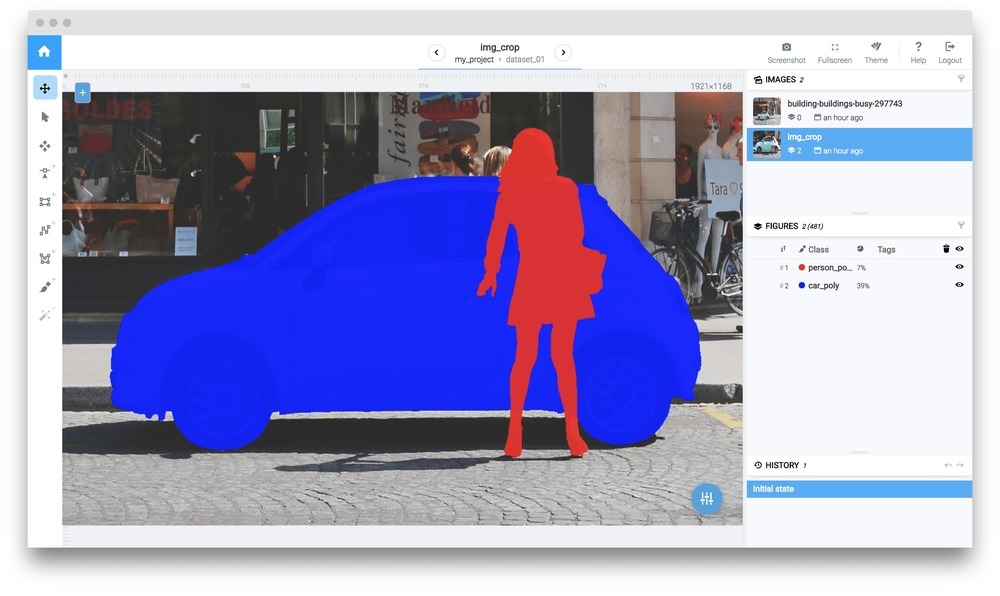
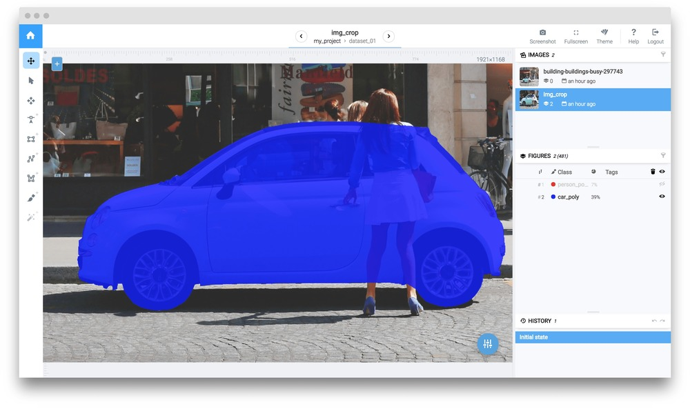

## Task description

[Here](/export/examples/drop-classes-simple/drop-classes-simple) we described how we can drop object in a simple annotation case.

But what if annotations were performed with the polygonal tool. And the final mask is the result of sequential overlay of objects. Here is an example. 

Final overlay:



Hide the "Person" object:



As you can see, when we annotate with polygons it is convenient to anotate objects with intersections. First we annotated the "car" object, then annotated the "person" object. If we want to get the final overlay we have to: 1) draw the car 2) draw the person.  

But if we want to train a car segmentation model, we cannot simply drop person object (like in [this](/export/examples/drop-classes-simple/drop-classes-simple) example). 

We have to convert objects to bitmaps by rasterizing them and only after that drop the unnecessary classes. Here is the final result we want to get:


## Rasterization technique

Go to "DTL" and execute this DTL query:

```json
[
  {
    "action": "data",
    "src": [
      "my_project/*"
    ],
    "dst": "$sample",
    "settings": {
      "classes_mapping": "default"
    }
  },
  {
    "action": "rasterize",
    "src": [
      "$sample"
    ],
    "dst": "$sample1",
    "settings": {
      "classes_mapping": {
        "person_poly": "person_bm",
        "car_poly": "car_bm"
      }
    }
  },
  {
    "dst": "$sample2",
    "src": [
      "$sample1"
    ],
    "action": "drop_obj_by_class",
    "settings": {
      "classes": [
        "person_bm"
      ]
    }
  },
  {
    "action": "supervisely",
    "src": [
      "$sample2"
    ],
    "dst": "my_project_masks_only_car",
    "settings": {}
  }
]
```

1. Layer #1 (`"action": "data"`) - get all data from project `my_project`. `"classes_mapping": "default"` means that we keep classes as they are. 

2. Layer #2 (`"action": "rasterize"`) - rasterize all objects. First, all objects are converted from polygons to bitmaps, so class `person_poly` becomes `person_bm`, `car_poly` becomes `car_bm`. Then all objects are drawn to the single bitmap (thus each pixel cannot be assigned to a few objects simultaneously). Than we restore all object instances from resulting bitmap. 

3. Layer #3 (`"action": "drop_obj_by_class"`) - drop all objects of class `person_bm`

4. Layer #4 (`"action": "supervisely"`) - save results to the project with name `my_project_masks_only_car`.


As a result we get only one class "car", all "car" objects now are correct and we can use this data to train car segmentation model. 


