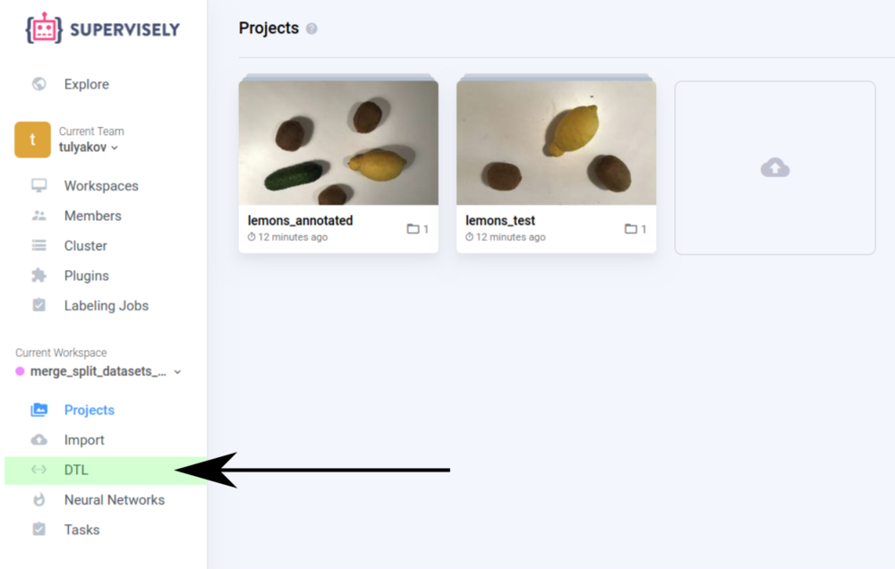
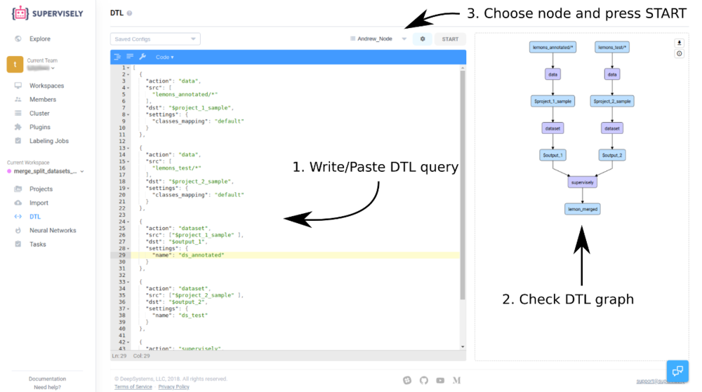
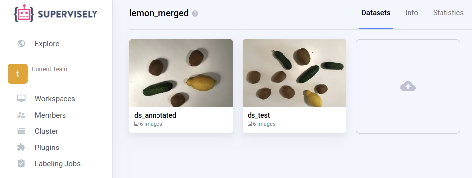

Here is a tutorial that describes how to merge and split datasets in a project.


## A simple case

For example we have project `"lemons_annotated"` with dataset `"ds1"` and project `"lemons_test"` with dataset `"ds1"`. 
Also we want to rename and merge all datasets into another project.
 
### Step 1. Go to DTL page.


### Step 2. Write DTL query.


You can see a simple computational graph which contains a few layers:

* 2 input data layers
* 2 dataset naming layers
* 1 save data layer

First and second layer define the project we will use. Third and fourth is the [`Dataset`](/export/dataset) layer that moves data flow to the selected dataset. Fifth layer just saves all input data to the new `lemon_merged` project.


Here is the DTL query from our example:

```json
[
  {
    "dst": "$project_1_sample",
    "src": [
      "lemons_annotated/*"
    ],
    "action": "data",
    "settings": {
      "classes_mapping": "default"
    }
  },
  {
    "dst": "$project_2_sample",
    "src": [
      "lemons_test/*"
    ],
    "action": "data",
    "settings": {
      "classes_mapping": "default"
    }
  },
  {
    "dst": "$output_1",
    "src": [
      "$project_1_sample"
    ],
    "action": "dataset",
    "settings": {
      "name": "ds_annotated"
    }
  },
  {
    "dst": "$output_2",
    "src": [
      "$project_2_sample"
    ],
    "action": "dataset",
    "settings": {
      "name": "ds_test"
    }
  },
  {
    "dst": "lemon_merged",
    "src": [
      "$output_1",
      "$output_2"
    ],
    "action": "supervisely",
    "settings": {}
  }
]
```

### Step 3. View results.

When the task is finished, the new project `"lemon_merged"` will appear on the "Projects" page. This project will contain 2 datasets ("ds_annotated" and "ds_test").

Here is the result:



---


## Conflict case
For example we have project `"Project_AB"` (contains datasets `dsA`, `dsB`) and project  `"Project_A"` (contains only the dataset `dsA`). 

### DTL query
We want to just merge all datasets into another a new project. We don't want to rename conflicting names:

```json
[
  {
    "dst": "$output_1",
    "src": [
      "Project_AB/*"
    ],
    "action": "data",
    "settings": {
      "classes_mapping": "default"
    }
  },
  {
    "dst": "$output_2",
    "src": [
      "Project_A/*"
    ],
    "action": "data",
    "settings": {
      "classes_mapping": "default"
    }
  },
  
  {
    "dst": "Project_AB_and_A",
    "src": [
      "$output_1",
      "$output_2"
    ],
    "action": "supervisely",
    "settings": {}
  }
]
```


### Names conflict resolving results

When the task is finished, the new project `"Project_AB_and_A"` will appear on the "Projects" page. That project will contain 3 datasets (`"Project_AB__dsA"`, `"Project_A__dsA"`, `"dsB"`).

Here is the result:


