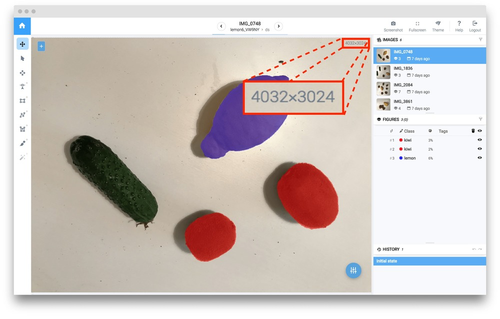
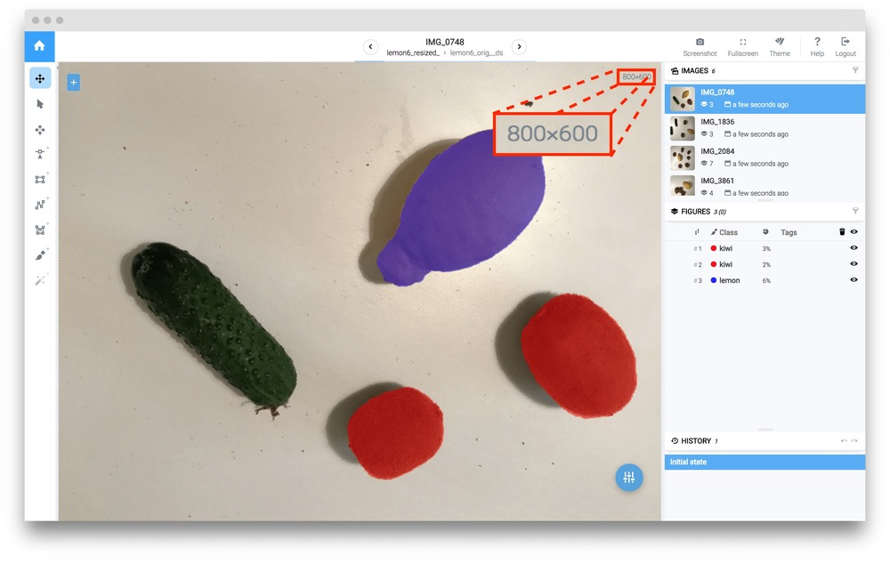

## Task description

For example we have project "lemon6_orig" with images in high resolution 4032x3024. 

For the annotation team it is better to work (annotate) with original images because they will be able to obtain high quality annotations even for very small objects. 

But for data scientists it is better to work with resized version of the images and annotations because: 1) in general neural networks cannot be trained on high resolutional images due to hardware issues, 2) they do a lot of experiments with different data augmentations and it takes a lof of computational time to apply augmentations to the original images. 

That is why the case for resizing images and their annotations is essential. For example, we want to resize images with anotations to the resolution 800x600 and then data scientists can easily use the resized version to make a few experiments with training on different resulutions: 512x512 or 256x256. 

Here is the original image:



## Step 1. Go to the DTL page.

## Step 2. Write the DTL query.

You can see a simple computational graph. Here is the DTL query from our example. We have only three layes here: the first layer defines the project we will use. The second layer is the ["Resize"] layer that will perform resizing of images and annotations. Third Layer is [Supervisely layer](/export/supervisely) that will save results to new project - "lemon6_resized".  


```json
[
  {
    "action": "data",
    "src": [
      "lemon6_orig/*"
    ],
    "dst": "$sample",
    "settings": {
      "classes_mapping": "default"
    }
  },
  {
    "action": "resize",
    "src": ["$sample"],
    "dst": "$data2",
    "settings": {
      "width": 800,
      "height": -1,
      "aspect_ratio": {
        "keep": true
      }
    }
  },
  {
    "action": "supervisely",
    "src": [
      "$data2"
    ],
    "dst": "lemon6_resized",
    "settings": {}
  }
]
```


Just press start button to start the process. 

## Step 3. View results.

When the task is finished, the new project "lemon6_resized" will appear on "Projects" page. Here is the result:




