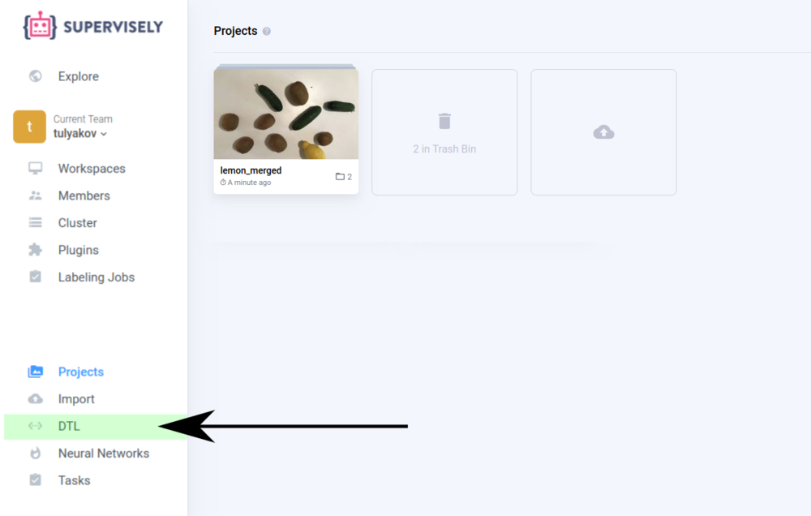
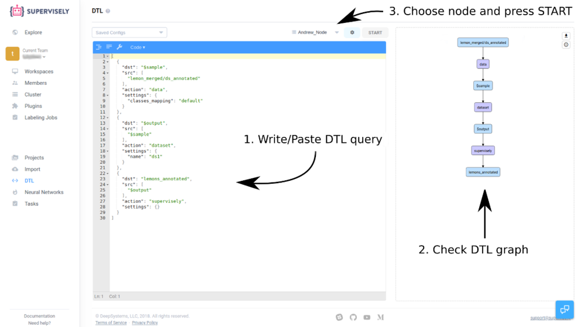

Here is a tutorial that describes how to save the target dataset from one project to a new project.


DTL allows only one save layer now


For example we have the project `"lemon_merged"` which contains datasets `"ds_annotated"`, `"ds_test"` and we want to save the dataset `"ds_annotated"` to the new project `"lemons_annotated"`. 


### Step 1. Go to the DTL page.


### Step 2. Write the DTL query.



The first layer defines the project and dataset we will use. The second is the [`Dataset`](/export/dataset) layer that moves data flow to the selected dataset. The third layer just saves all input data to the new `lemons_annotated` project.

Here is the DTL query from our example:

```json
[
  {
    "action": "data",
    "src": [
      "lemon_merged/ds_annotated"
    ],
    "dst": "$sample",
    "settings": {
      "classes_mapping": "default"
    }
  },
  
  {
    "action": "dataset",
    "src": ["$sample" ],
    "dst": "$output",
    "settings": {
      "name": "ds1"
    }
  },
  
  {
    "action": "supervisely",
    "src": [
      "$output"
    ],
    "dst": "lemons_annotated",
    "settings": {}
  }
]
```

### Step 3. View results.

When the task is finished, the new project `"lemons_annotated"` will appear on the "Projects" page. It will contain 1 dataset `"ds1"`.

Here is the result:


