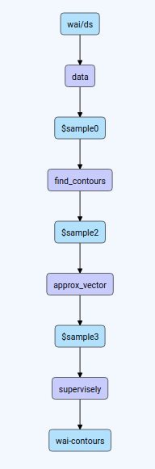
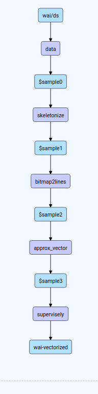
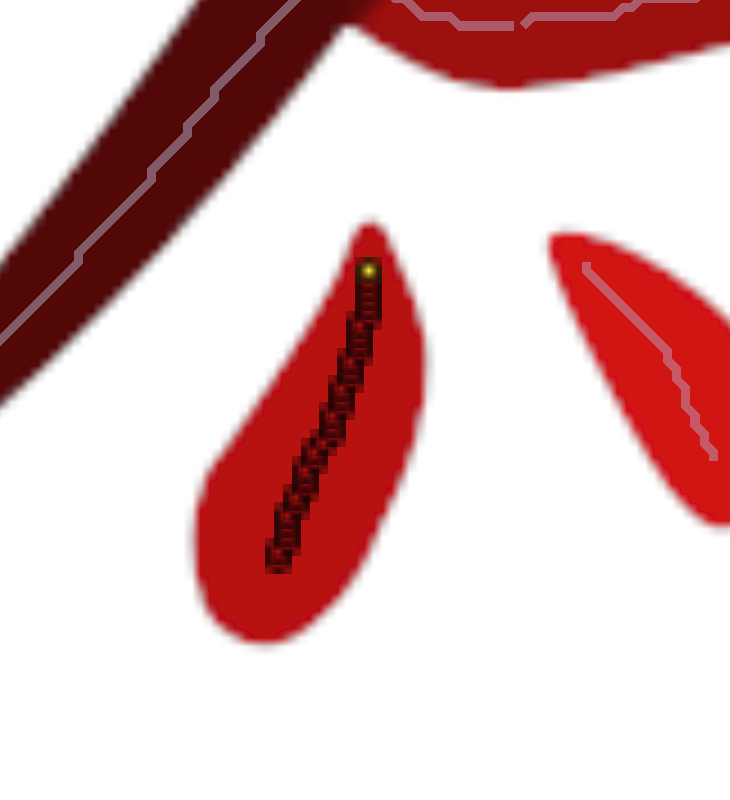
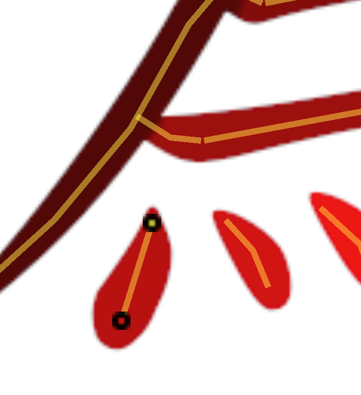
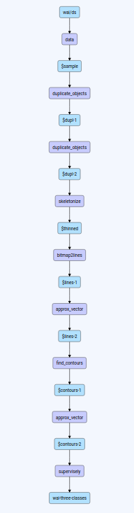
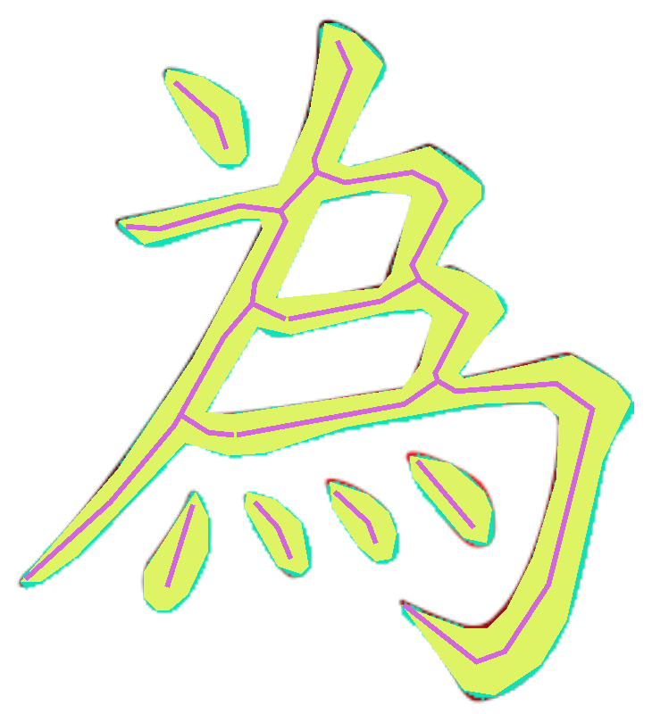

## Preface

Suppose we have some annotations of shape "bitmap", but want to work with vector objects. What can we do? Use DTL, of course.

The task is very common. Annotations in form of masks may be obtained from different sources, including:

 - manual annotation, may be with our awesome [Smart Tool](https://supervise.ly/smart-tool)

 - segmentation results from some [appropriate neural network](/neural-networks/supported_nns/#semantic-segmentation), e.g. [UNet](/neural-networks/examples/unet/)

 - something else


But in many cases it is preferable to work with or produce result in form of vector objects. They are, after all, sligtly more... machine-friendly.

Let's start with some image. Annotate it with Smart Tool and get a single mask of class "char-bitmap".

<div class="previews">
  <span>
    
    <span>Source image.</span>
  </span>
  <span>
    
    <span>Source image with mask object.</span>
  </span>
</div>


## Find contours

The most natural action is to find contours of mask. We can simply do it with [Find Contours](/export/find_contours) layer. From our single mask (shape "bitmap") it will generate some polygons -- with holes, if it's needed.

After that, we can find that resulting polygons have too many vertices. If we aren't satisfied with it, decrease number of vertices by approximating the polygons. [Approx Vector](/export/approx_vector) layer will help us.

Here is the DTL graph:



```json
[
  {
    "action": "data",
    "src": [
      "wai/ds"
    ],
    "dst": "$sample0",
    "settings": {
      "classes_mapping": "default"
    }
  },
  {
    "dst": "$sample2",
    "src": [
      "$sample0"
    ],
    "action": "find_contours",
    "settings": {
      "classes_mapping": {
        "char-bitmap": "char-poly"
      }
    }
  },
  {
    "action": "approx_vector",
    "src": [
      "$sample2"
    ],
    "dst": "$sample3",
    "settings": {
      "classes": [
        "char-poly"
      ],
      "epsilon": 2
    }
  },
  {
    "action": "supervisely",
    "src": [
      "$sample3"
    ],
    "dst": "wai-contours",
    "settings": {}
  }
]
```

Here is the result:

<div class="previews">
  <span>
    
    <span>Source mask.</span>
  </span>
  <span>
    
    <span>Polygons after processing.</span>
  </span>
</div>

Now we got six polygons, with required holes in the largest.

<div class="previews">
  <span>
    
    <span>Largest polygon selected.</span>
  </span>
</div>

Let's see how approximation works:

<div class="previews">
  <span>
    
    <span>Polygon after "Find Polygons" without approximation.</span>
  </span>
  <span>
    
    <span>Polygon after approximation (epsilon=2).</span>
  </span>
</div>


## Get skeleton

Another thing which may be required is extracting a skeleton from a bitmap. Simple DTL pipeline allows to do it. We will get figures of shape "line" as a result.

Here is the example of converting our "line-shaped" bitmap to convenient vector objects. We'll do the following:

 - Thin bitmap with [Skeletonize](/export/skeletonize) layer, getting bitmap of "one-pixel edges".

 - Convert thinned bitmap to objects of shape "line" with [Bitmap to Lines](/export/bitmap2lines) layer.

 - approximate line objects to decrease number of vertices with [Approx Vector](/export/approx_vector) layer.


Here is the DTL graph:



```json
[
  {
    "action": "data",
    "src": [
      "wai/ds"
    ],
    "dst": "$sample0",
    "settings": {
      "classes_mapping": "default"
    }
  },
  {
    "dst": "$sample1",
    "src": [
      "$sample0"
    ],
    "action": "skeletonize",
    "settings": {
      "method": "thinning",
      "classes": [
        "char-bitmap"
      ]
    }
  },
  {
    "dst": "$sample2",
    "src": [
      "$sample1"
    ],
    "action": "bitmap2lines",
    "settings": {
      "min_points_cnt": 2,
      "classes_mapping": {
        "char-bitmap": "char-line"
      }
    }
  },
  {
    "action": "approx_vector",
    "src": [
      "$sample2"
    ],
    "dst": "$sample3",
    "settings": {
      "classes": [
        "char-line"
      ],
      "epsilon": 2
    }
  },
  {
    "action": "supervisely",
    "src": [
      "$sample3"
    ],
    "dst": "wai-vectorized",
    "settings": {}
  }
]
```

Here is the result:

<div class="previews">
  <span>
    
    <span>Source mask.</span>
  </span>
  <span>
    
    <span>Resulting skeleton, figures of shape "line".</span>
  </span>
</div>

In details, this is how Skeletonize layer works:

<div class="previews">
  <span>
    
    <span>Source mask.</span>
  </span>
  <span>
    
    <span>Thinned mask. It's still a figure of shape "bitmap".</span>
  </span>
</div>

And this is why we need approximation with Approx Vector layer:

<div class="previews">
  <span>
    
    <span>Line obtained brom bitmap, without approximation.</span>
  </span>
  <span>
    
    <span>The line after approximation: two vertices.</span>
  </span>
</div>

Of course, the approximation may be "softer", producing smoother lines with more vertices. It is tuned by `epsilon` parameter in Approx Vector layer.

## Duplicate Objects for complicated conversions

As an example, consider the two pipelines above. Our purpose is to get the following figures on the same image:

 - source mask ("bitmap")
 - found contours ("polygon"s)
 - found skeleton ("line"s)

It is useful in different cases, which this margin is too narrow to contain.

We'll simply apply [Duplicate Objects](/export/duplicate_objects) layer to copy objects. Actually, we'll apply it twice:

 - There is a class "char-bitmap", and we want to save it.

 - Clone it to temporary class "bitmap-to-poly", which will be converted to "char-poly" polygons later.

 - And clone "char-bitmap" again to temporary class "bitmap-to-line", which will be converted to "char-line" lines later.


After that, we just need to stack the previous two pipelines. No branching.

Here is the DTL graph:



```json
[
  {
    "action": "data",
    "src": [
      "wai/ds"
    ],
    "dst": "$sample",
    "settings": {
      "classes_mapping": "default"
    }
  },
  {
    "dst": "$dupl-1",
    "src": [
      "$sample"
    ],
    "action": "duplicate_objects",
    "settings": {
      "classes_mapping": {
        "char-bitmap": "bitmap-to-poly"
      }
    }
  },
  {
    "dst": "$dupl-2",
    "src": [
      "$dupl-1"
    ],
    "action": "duplicate_objects",
    "settings": {
      "classes_mapping": {
        "char-bitmap": "bitmap-to-line"
      }
    }
  },
  {
    "dst": "$thinned",
    "src": [
      "$dupl-2"
    ],
    "action": "skeletonize",
    "settings": {
      "method": "thinning",
      "classes": [
        "bitmap-to-line"
      ]
    }
  },
  {
    "dst": "$lines-1",
    "src": [
      "$thinned"
    ],
    "action": "bitmap2lines",
    "settings": {
      "min_points_cnt": 2,
      "classes_mapping": {
        "bitmap-to-line": "char-line"
      }
    }
  },
  {
    "action": "approx_vector",
    "src": [
      "$lines-1"
    ],
    "dst": "$lines-2",
    "settings": {
      "classes": [
        "char-line"
      ],
      "epsilon": 2
    }
  },
  {
    "dst": "$contours-1",
    "src": [
      "$lines-2"
    ],
    "action": "find_contours",
    "settings": {
      "classes_mapping": {
        "bitmap-to-poly": "char-poly"
      }
    }
  },
  {
    "action": "approx_vector",
    "src": [
      "$contours-1"
    ],
    "dst": "$contours-2",
    "settings": {
      "classes": [
        "char-poly"
      ],
      "epsilon": 2
    }
  },
  {
    "action": "supervisely",
    "src": [
      "$contours-2"
    ],
    "dst": "wai-three-classes",
    "settings": {}
  }
]
```

Here is the result. Lines are purple, bitmap is blue. Polygons are yellow.

<div class="previews">
  <span>
    
    <span>Bitmap, polygons and lines.</span>
  </span>
</div>
