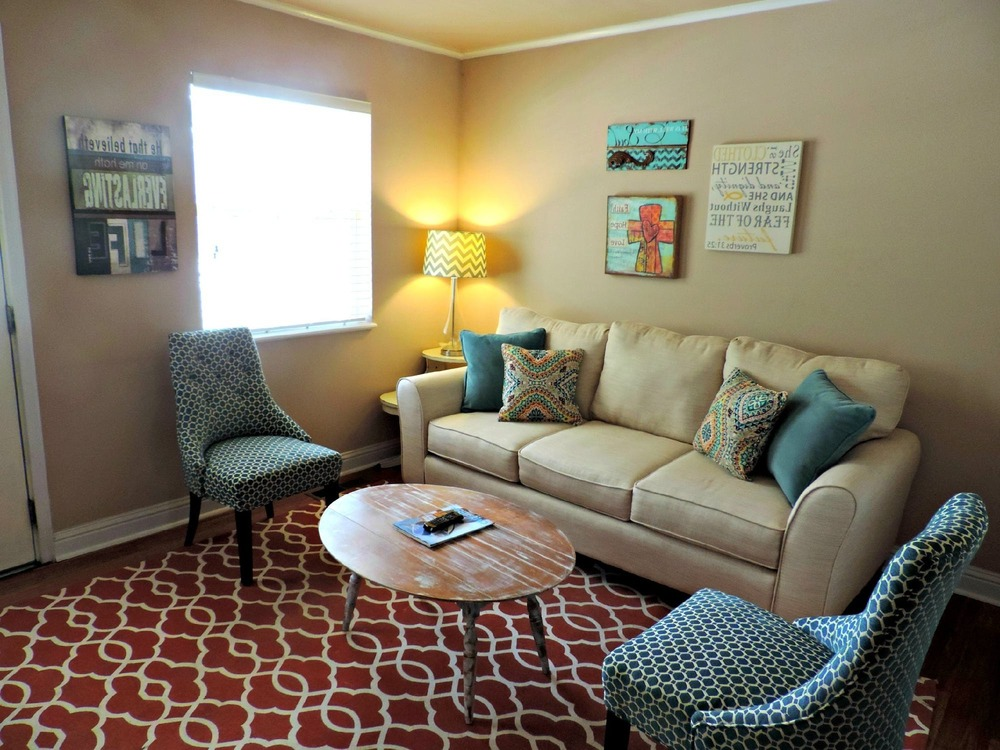
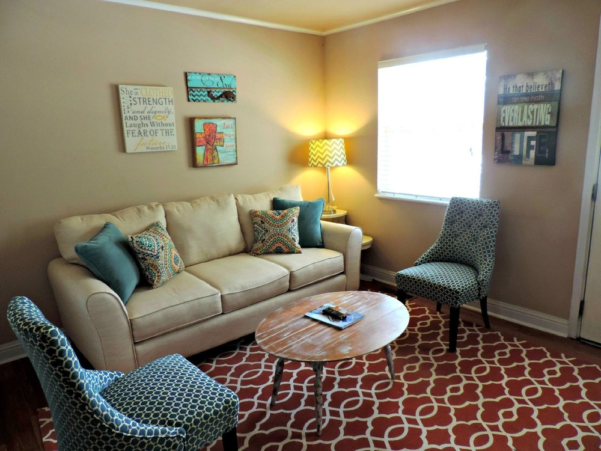
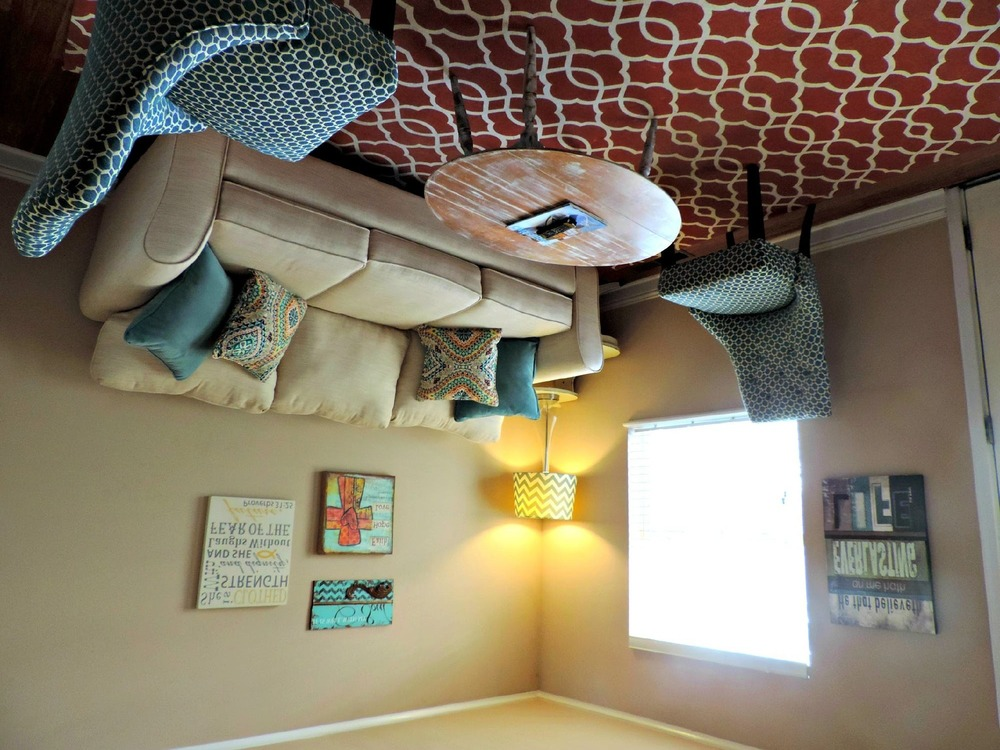
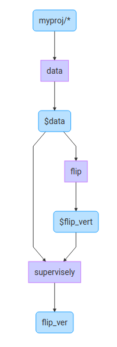

Flip layer (`flip`) simply flips data (image + annotation) vertically or horizontally.

```json
{
  "action": "flip",
  "src": ["$data1"],
  "dst": "$data2",
  "settings": {
    "axis": "vertical"
  }
}
```

`"axis"` field can be one of two values `horizontal` or `vertical`.

Here are the possible results:

<span style="display:flex;">
    <span style="margin:5px;">
      
      <span>Original image</span>
    </span>
    <span style="margin:5px;">
      
      <span style="text-align: center;">"axis": "vertical"</span>
    </span>
    <span style="margin:5px;">
      
      <span>"axis": "horizontal"</span>
    </span>
</span>

## Example

```json
[
  {
    "dst": "$data",
    "src": [
      "myproj/*"
    ],
    "action": "data",
    "settings": {
      "classes_mapping": "default"
    }
  },
  {
    "dst": "$flip_vert",
    "src": [
      "$data"
    ],
    "action": "flip",
    "settings": {
      "axis": "vertical"
    }
  },
  {
    "dst": "flip_ver",
    "src": [
      "$data",
      "$flip_vert"
    ],
    "action": "supervisely",
    "settings": {}
  }
]
```



In this example we just get all data (images + annotations) from project `myproj`, apply vertical flip to images and save both original and flipped version.
