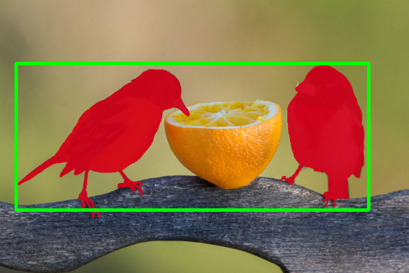
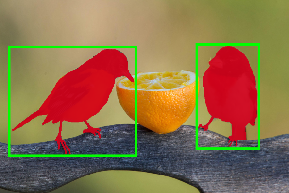

This layer (`split_masks`) takes one bitmap annotation and split it into few bitmap masks if it contain non-connected components.

```json
{
  "src": [
    "$sample1"
  ],
  "dst": "$sample2",
  "action": "split_masks",
  "settings": {
    "classes": ["Bird", "Potato"]
  }
}
```

## Settings

- `classes` — list of class names for split operation.


## Visual example:

Before:



After:




## Similar commands:
* [Merge Masks](/export/merge_masks)
