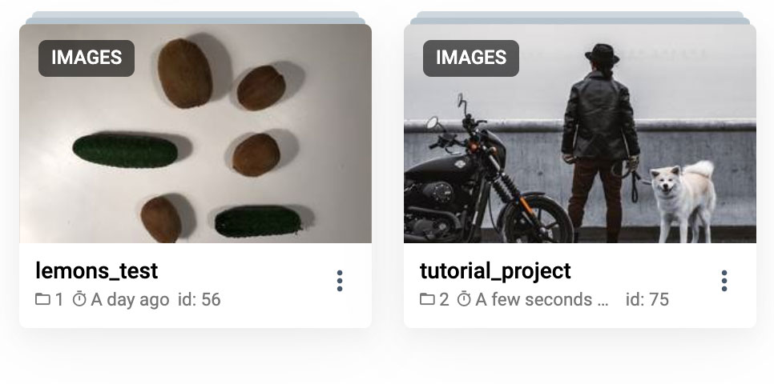

# First steps

Sounds good, huh? Onboarding takes no more than five minutes, so let's go! 💥

### 🏁 Create an account

Supervisely is free for non-commercial usage and requires no card info. Go to the [**signup page**](https://app.supervise.ly/signup), choose login and password to create your personal account. You can sign in through the GitHub or Google Account too.


If you feel Supervisely is the right fit for you and your company,  feel free to [contact us](https://supervise.ly/contact) and get an Enterprise Edition — a self-hosted version with advanced data security, customization and [more](https://supervise.ly/enterprise)!


### 👋 Invite more people

When you create an account we automatically create a new **team** for you that has the same name as your login. You are the only member right now — but you can invite your colleagues and work on the same data together!

### 📂 Import some data

Go to the **import** page and create a new **project** by uploading some data: images \(.png, .jpg\), videos \(.mp4, .avi\), 3D point clouds \(.pcd\) or even well known dataset formats like KITTY and PascalVOC.

We support such a variety of formats using **plugins** concept: and you can always add your own!


Don't have any datasets yet? We do! Check out our **explore** section and grab yourself a sample project.


### 🔍 Explore your data

Go to the **projects** page to see your new project: a set of datasets \(aka folders\) that share the same settings, defined tags and so on. Click on a dataset to open corresponding annotation tool and create some polygons or bitmaps or tag your images.

### 🖥 Connect your PC and run a neural net

Get some benefit from your datasets — train a new neural network or apply an existing one. By the way, we have a bunch of them in our model zoo: like UNet or DeepLab.

Before you start, you need to connect a computer with GPU on board to the platform, so that you can deploy new tasks right from the web interface.

Thankfully, it's super easy to do: just add a new **agent** at the **cluster** page and run the one-liner on your computer: that's it!


If you don't have a computer with GPU, no worries: in the modal window you will get a link to the AWI and rent an AWS instance.


### Next Steps

Now you know the basics, but there is so much more to explore! Data augmentation, consensus labeling, data statistics and visualization, Python SDK and API and even more.

Enjoy Supervisely, leave your feedback at [support@supervise.ly](mailto:support@supervise.ly) and see you in our [Slack group](https://supervise.ly/slack)!

