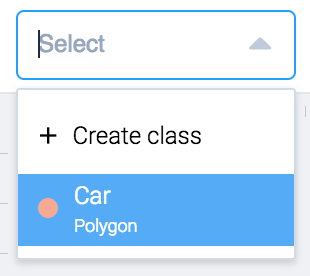
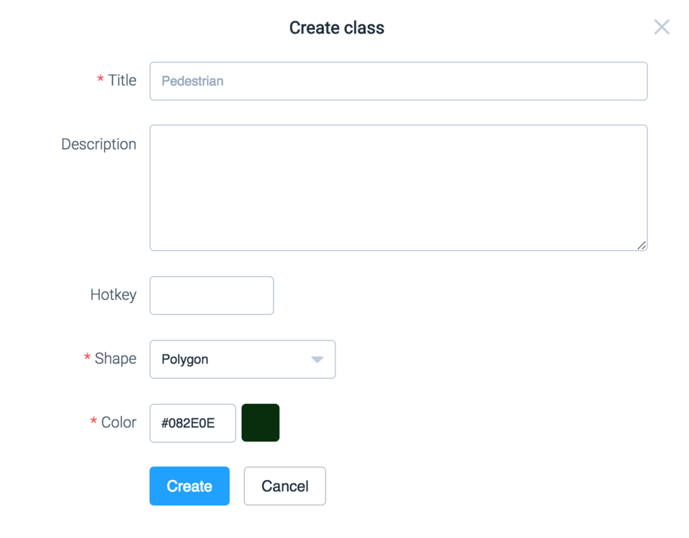

Instruments panel on the left side of the screen provides tools to create and edit annotations and manipulate scene.

Only one instrument can be selected at a time.

## Auxiliary tools

Use the following tools to interact with scene and figures on it in a general way. Those tools doesn't take into account class of annotation or it's shape.

### Move tool

Choose move tool to pan and zoom image on the scene. While in `Move tool` is active, interactions with annotations on scene are disabled.

### Select tool

Use `Select tool` to select figures (annotations) directly on the scene.

Immediately after selecting a figure, corresponding editing tool with be enabled and you can start changing the annotation.


You can also select annotations by clicking on interesting in [figures panel](/annotation/figures).


### Drag tool

If you need to drag figures on the scene, select `Drag tool`, move mouse cursor over an interesting figure and drag it to a new position.

### Tag figures tool

If you need to manipulate figure tags or description, select `Tag figures tool` and click on the tag to open figure tags popup.

## Annotation tools

Use annotation tools to create new and change existing figures.

### Shapes & Classes

Each annotation instrument is used to create one of the following shapes:

- Point
- Line
- Rectangle
- Polygon
- Bitmap

In Supervisely by design each `Class` must be one (and only one!) of the shapes above. It means, that you can't have two figures of class "Car" of different shapes.

Thus, every tool can create only classes of it's shape: say, if you created a class `Road Sign` of shape `Rectangle`, you can only create road signs with `Rectangle tool`.

### Create vs Edit

Each of those tools has indicator icon at the top right corner of the button that shows if you are editing existing figure or are going to add a new one:

You can add new points or drag them in both creation and editing mode.


Adding a new figure is no different from editing. Internally, after you create first point (first pixel) of a new figure, you will automatically select a new figure and switch to editing mode.


### Common settings

When one of annotation tools is selected, you will see instrument settings on top bar. Every tool has it's own settings, but all annotation instruments share those two options:

#### Class selector

Every figure must have exactly one class. You can predefine list of classes in `Project` settings or add new classes right from the annotation interface.

Choose a class you want to annotate on the image (in [create mode](#create-vs-edit)) or change class of exiting shape (in [editing mode](#create-vs-edit)).


You can enter a hotkey to quickly select interesting class (and tool that is used to create this class).


To add new class, select `Create class` option from dropdown menu:

You must choose a *shape* as [described](#shapes-classes) above.

*Color* will be used to draw the shape on the main scene.

#### Commit button

Press commit button to save current figure and switch instrument to create mode.


All changes you make with figures are saved automatically



Press `SPACE` key to commit changes


### Point tool

Create or change figure of `Point` shape. Click anywhere on the scene to create new point, then drag it or press [commit button](#commit-button) to save figure and start new figure.

`Point` shape contains *exactly one point* (aka `Landmark`).

### Rectangle tool

Create or change figure of `Rectangle` shape. Click anywhere on the scene to create top left point of the rectangle, then click second time to create bottom right point. Drag points or press [commit button](#commit-button) to save figure and start new figure.

`Rectangle` shape contains *exactly two* points.

### Polyline tool

Create or change figure of `Polyline` shape. Click anywhere on the scene to create first point, then click multiple times to create  new points connected with line. Drag points or press [commit button](#commit-button) to save figure and start new figure.

`Polyline` shape contains *one or more* points.

Polyline tool has several modes:

**Add points consecutively**

Each click will connect new point with the previously created one.

**Add points to the closest segment**

Each click will connect new point with the closest point.

**Remove points**

While in remove mode click on points to delete them.

### Polygon tool

Create or change figure of `Polygon` shape. Click anywhere on the scene to create first point, then click multiple times to create  new points that forms closed area. Drag points or press [commit button](#commit-button) to save figure and start new figure.

`Polygon` shape contains *one or more* points.

Polygon tool has the same modes as [Polyline tool](#polyline-tool), plus two more:

**Set point as the first one**

Use this mode to select point in polygon that will be connect with the last added point to form a closed shape. By default last point would be connected with the first one.

**Add hole**

You can add multiple holes inside polygons as described [here](/annotation/figures#holes). `Add hole` only available when you have selected existing polygon to edit.

Click on `Add hole` to go into `Polygon` creating mode and use the same actions and modes as described above. After pressing [commit button](#commit-button) new hole will appear inside main polygon.

You can edit existing holes by selecting them in [figures panel](/annotation/figures).

### Bitmap tool

Create or change figure of `Bitmap` shape. Bitmap doesn't have points to create or drag. Instead, `Bitmap` shape is a pixel mask.


Because bitmaps are not an array of points (as other instruments above), you can't apply brush or other bitmap tools to existing shapes like `Polygon`.


Use the following models to draw or erase pixels from image:

**Brush**

Click anywhere on the scene, hold mouse button and draw shape you want. You can control size of the brush using field on the right.

**Eraser**

Click anywhere on the scene, hold mouse button and erase unwanted pixels. You can control size of the eraser using field on the right.

**Fill**

You can quickly assign pixels of a custom shape with interesting class. Select `Fill` mode, then click at least three times on the scene to form a polygon to fill and then click `Apply changes` button on the right.

**Crop**

You can quickly subtract pixels of a custom shape from current figure. Select `Crop` mode, then click at least three times on the scene to form a polygon to subtract and then click `Apply changes` button on the right.

### Smart tool

Smart tool creates `Bitmap` shape, predicted by AI.

Click anywhere on the scene to create top left point of the rectangle, then click second time to create bottom right point. Neural network will try to find dominant object inside that rectangle. Drag points to recalculate bitmap, feed additional feedback (read below) or press [commit button](#commit-button) to save figure and start new figure.


After you click [commit button](#commit-button) you will start creating new figure using smart tool. If you want to save current shape and edit it as a bitmap, use  button.



When you create a figure using smart tool you can interact with a neural network by providing ROI and other feedback. After you click [commit button](#commit-button) current shape will be saved as a `Bitmap` shape and can be edited using `Bitmap tool`.


An important feature of smart tool is the ability to correct results by pointing neural network zones to include or exclude. The following modes are available:

**Positive Point**

Click and place point on part of the *object* that should be *included* in final shape. You can then drag the point.

**Negative Point**

Click and place point on part of the *background* that should be *excluded* in final shape. You can then drag the point.

**Positive Brush**

Draw a shape on part of the *object* that should be *included* in final shape. You can control size of the brush using field on the right.

**Negative Brush**

Draw a shape on part of the *background* that should be *excluded* in final shape. You can control size of the brush using field on the right.

**Eraser**

Remove shapes you have drawn using `Positive Brush` and `Negative Brush`. You can control size of the eraser using field on the right.
